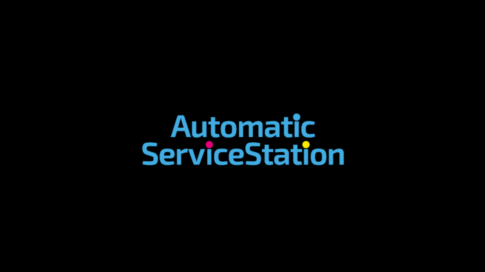
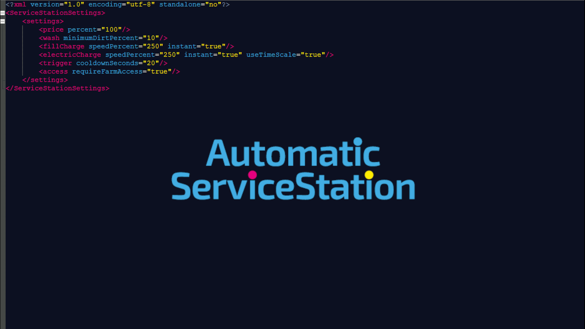
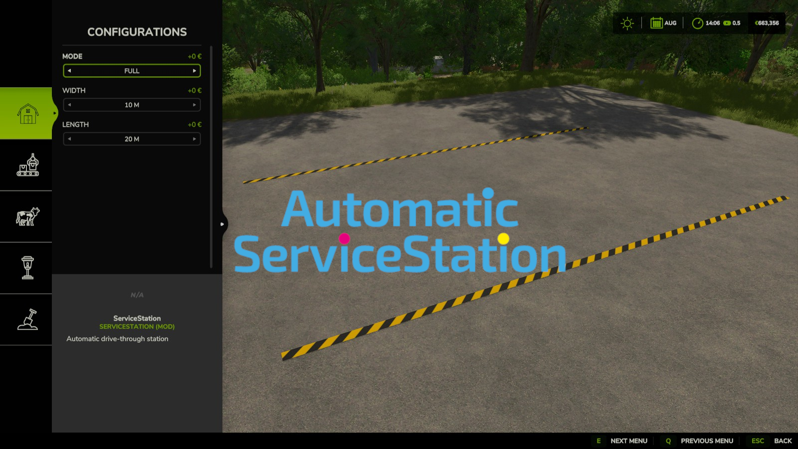
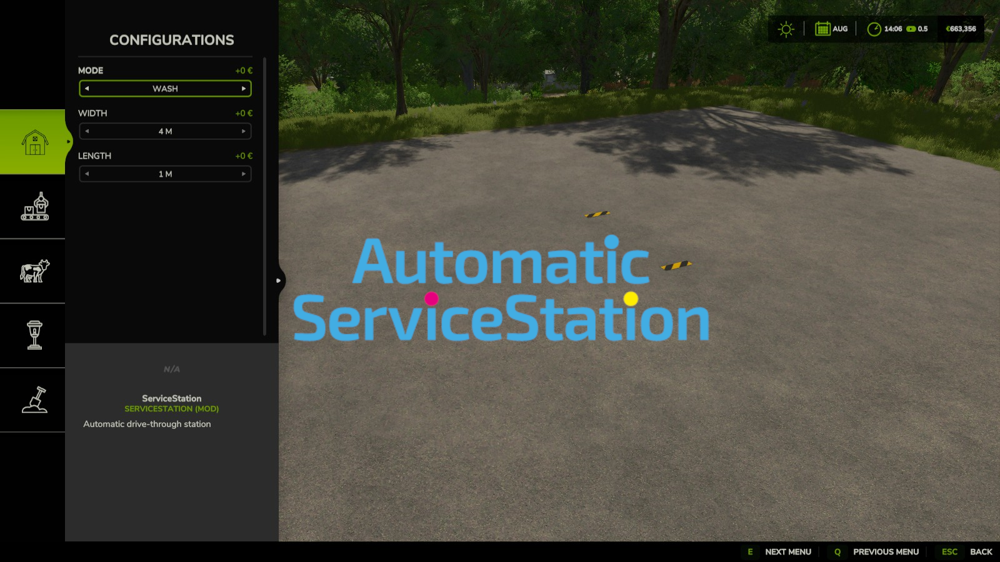

# 

[WEBSITE](https://blu3cow.com) | [DISCORD](https://discord.gg/JdKvhdheU) | [DOWNLOAD](https://github.com/BLU3COW/FS25_ServiceStation/releases) | [README](README.md) |  [LICENSE](LICENSE) | [ISSUES](https://github.com/BLU3COW/FS25_ServiceStation/issues) | [DISCUSSIONS](https://github.com/BLU3COW/FS25_ServiceStation/discussions) | [PULLS](https://github.com/BLU3COW/FS25_ServiceStation/pulls)

 

With <strong>ServiceStation</strong>, you get a single customizable drive-through station for washing, repairing, repainting, refueling, and charging your vehicles, instead of placing several separate objects on your farm. Adjust the width and length of the station so it fits your yard perfectly, and choose exactly which services it should offer.
  
Choose between the modes <strong>Full</strong>, <strong>Service</strong>, <strong>Tank</strong>, and <strong>Wash</strong> directly in construction mode before placing the station. Further improvements are already being considered. Want to help shape the project? Feel free to get involved and share your requests, suggestions, or ideas for improvement.

 

 ➡️​ <strong>Deutsch</strong> ⬅️ ​

 

Mit der <strong>ServiceStation</strong> bekommst du eine einzige, individuell anpassbare Durchfahrstation zum Waschen, Reparieren, Lackieren, Tanken und Laden deiner Fahrzeuge, anstatt mehrere einzelne Objekte auf deinem Hof zu platzieren. Passe Breite und Länge der Station an, damit sie perfekt zu deinem Hof passt, und wähle genau aus, welche Leistungen sie anbieten soll.
  
Wähle direkt im Baumodus vor dem Platzieren zwischen den Modi <strong>Full</strong>, <strong>Service</strong>, <strong>Tank</strong> und <strong>Wash</strong>. Weitere Verbesserungen sind bereits in Überlegung. Du möchtest das Projekt mitgestalten? Dann bring dich gerne ein und teile deine Wünsche, Vorschläge oder Ideen zur Verbesserung.

 

 

## 

| Mode | Wash | Repair | Repaint | Diesel / DEF | Methane | Electric | Default |
| --- | --- | --- | --- | --- | --- | --- | --- |
| Full | ✔️ | ✔️ | ✔️ | ✔️ | ✔️ | ✔️ | ON |
| Service | --- | ✔️ | ✔️ | --- | --- | --- | OFF |
| Tank | --- | --- | --- | ✔️ | ✔️ | ✔️ | OFF |
| Wash | ✔️ | --- | --- | --- | --- | --- | OFF |

 

Choose the mode when configuring the ServiceStation in construction mode, before placing it. <strong>Full</strong> offers every service in one station. <strong>Service</strong> only repairs and repaints, <strong>Tank</strong> only refuels and charges, and <strong>Wash</strong> only washes. This lets you build a single all-in-one station, or split services across several smaller, cheaper stations if you prefer.

 

 ➡️​ <strong>Deutsch</strong> ⬅️ ​

 

Den Modus wählst du bei der Konfiguration der ServiceStation im Baumodus, bevor du sie platzierst. <strong>Full</strong> bietet alle Leistungen in einer Station. <strong>Service</strong> repariert und lackiert nur, <strong>Tank</strong> tankt und lädt nur, und <strong>Wash</strong> wäscht nur. So kannst du dir eine einzige Allround-Station bauen oder die Leistungen bei Bedarf auf mehrere kleinere, günstigere Stationen aufteilen.

 

## 

| Dimension | Minimum | Maximum | Steps | Default |
| --- | --- | --- | --- | --- |
| Width | 2 m | 20 m | 1 m | 10 m |
| Length | 0.5 m | 40 m | 0.5 – 5 m | 20 m |

 

Both width and length are configured in construction mode before placing the station, so it fits your yard, your fields, or your vehicle sizes. The purchase price stays the same regardless of the chosen dimensions.

 

 ➡️​ <strong>Deutsch</strong> ⬅️ ​

   

Breite und Länge werden beide im Baumodus vor dem Platzieren eingestellt, damit die Station zu deinem Hof, deinen Feldern oder deinen Fahrzeuggrößen passt. Der Kaufpreis bleibt unabhängig von der gewählten Größe gleich.

 

## 

| Setting | English | German | Default |
| --- | --- | --- | --- |
| **price.percent** | Price scaling | Preis-Skalierung | 100 % |
| **wash.minimumDirtPercent** | Minimum dirt before washing | Mindestverschmutzung fürs Waschen | 5 % |
| **fillCharge.speedPercent** | Diesel / DEF / Methane speed | Diesel-/AdBlue-/Methan-Geschwindigkeit | 100 % |
| **fillCharge.instant** | Instantly fill Diesel / DEF / Methane | Diesel/AdBlue/Methan sofort auffüllen | OFF |
| **electricCharge.speedPercent** | Electric charge speed | Lade­geschwindigkeit Strom | 100 % |
| **electricCharge.instant** | Instantly charge electric vehicles | Elektrofahrzeuge sofort laden | OFF |
| **electricCharge.useTimeScale** | Scale electric charging with time scale | Laden mit Zeitraffer skalieren | ON |
| **trigger.cooldownSeconds** | Cooldown before re-servicing the same vehicle | Abklingzeit vor erneuter Bedienung | 10 s |
| **access.requireFarmAccess** | Only service vehicles your farm has access to | Nur Fahrzeuge mit Zugriffsrecht bedienen | ON |

 

By default, prices are unmodified, energy fills over time instead of instantly, and only vehicles your farm has access to are serviced. <strong>price.percent</strong> scales washing, repair, repaint, and fuel/charge prices together. <strong>wash.minimumDirtPercent</strong> avoids washing an already clean vehicle. <strong>fillCharge</strong> and <strong>electricCharge</strong> control how fast Diesel/DEF/Methane and electric charging are filled, or whether they should fill instantly instead. <strong>trigger.cooldownSeconds</strong> prevents the same vehicle chain from being serviced again immediately after leaving and re-entering the trigger, and <strong>access.requireFarmAccess</strong> controls whether other farms can use your station.

 

 ➡️​ <strong>Deutsch</strong> ⬅️ ​

   

Standardmäßig sind die Preise unverändert, Energie wird über Zeit statt sofort aufgefüllt, und es werden nur Fahrzeuge bedient, auf die dein Betrieb Zugriff hat. <strong>price.percent</strong> skaliert Wasch-, Reparatur-, Lackier- und Tank-/Ladepreise gemeinsam. <strong>wash.minimumDirtPercent</strong> verhindert das Waschen eines bereits sauberen Fahrzeugs. <strong>fillCharge</strong> und <strong>electricCharge</strong> steuern, wie schnell Diesel/AdBlue/Methan und der Strom-Ladevorgang befüllt werden, oder ob stattdessen sofort aufgefüllt werden soll. <strong>trigger.cooldownSeconds</strong> verhindert, dass dieselbe Fahrzeugkette direkt nach dem Verlassen und erneuten Einfahren sofort wieder bedient wird, und <strong>access.requireFarmAccess</strong> steuert, ob auch andere Betriebe deine Station nutzen können.

 

  

<strong>‼️Click to View „FS25_ServiceStation.xml" | Hier Klicken um „FS25_ServiceStation.xml" anzuzeigen‼️</strong>

### 
<strong><code>C:\Users\YourPC\Documents\My Games\FarmingSimulator2025\modSettings\FS25_ServiceStation.xml</code></strong>

 

The <strong>„FS25_ServiceStation.xml"</strong> file is created automatically when the mod is started for the first time.

 

 ➡️​ <strong>Deutsch</strong> ⬅️ ​

   

Die Datei <strong>„FS25_ServiceStation.xml"</strong> wird automatisch erstellt, sobald der Mod zum ersten Mal gestartet wird.
 

 

 

## 

There is no fixed roadmap yet. Ideas currently being considered include additional dimension presets and, further down the line, a dedicated GUI for managing the station settings directly in-game. Suggestions, ideas, and feedback are always welcome via Issues or Discussions.

 ➡️​ <strong>Deutsch</strong> ⬅️ ​

   

Es gibt noch keinen festen Fahrplan. Aktuell in Überlegung sind unter anderem zusätzliche Größen-Voreinstellungen und, etwas weiter in der Zukunft, eine eigene GUI zur Verwaltung der Stationseinstellungen direkt im Spiel. Vorschläge, Ideen und Feedback sind über Issues oder Discussions jederzeit willkommen.

   

## 

So far, many mods and customizations have been created primarily for personal use. Now, some of these projects will gradually be shared with the community. <strong>BLU3COW</strong> isn’t just about script mods. It also includes prefabs, objects, models, and practical customizations for <strong>Farming Simulator</strong>.
 
 
Since many projects are still in development, feedback, ideas, and suggestions for improvement are always welcome. Anyone interested is warmly invited to actively participate in the project, help develop content, find bugs, or contribute new ideas. This helps refine the mods further and tailor them more closely to the needs of the community.

   

 ➡️​ <strong>Deutsch</strong> ⬅️ ​

   

Bisher sind viele Mods und Anpassungen hauptsächlich für den eigenen Gebrauch entstanden. Nun sollen einige dieser Projekte nach und nach mit der Community geteilt werden. Bei <strong>BLU3COW</strong> geht es nicht nur um Skript-Mods. Dazu gehören auch Prefabs, Objekte, Modelle und praktische Anpassungen für den <strong>Landwitschafts Simulator</strong>.
 
 
Da sich viele Projekte noch in der Entwicklung befinden, sind Feedback, Ideen und Verbesserungsvorschläge jederzeit willkommen. Jeder, der Lust hat, ist herzlich eingeladen, sich aktiv am Projekt zu beteiligen, Inhalte weiterzuentwickeln, Fehler zu finden oder neue Ideen einzubringen. So können die Mods weiter verfeinert und besser auf die Bedürfnisse der Community abgestimmt werden.

 

## 

If you like ServiceStation and find it helpful in the game, you’re welcome to support its continued development via PayPal or with a virtual “Buy Me a Beer.” Every contribution helps us continue to develop new features, improvements, and mods.
 
 
You can also actively support the project by sharing your requests, ideas, suggestions for improvement, or bug reports. Any form of participation helps make ServiceStation better and more versatile.

 

 ➡️​ <strong>Deutsch</strong> ⬅️ ​

   

Wenn dir ServiceStation gefällt und dich im Spiel unterstützt, kannst du die Weiterentwicklung gerne über PayPal oder mit einem virtuellen „Buy Me a Beer" unterstützen. Jede Unterstützung hilft dabei, neue Funktionen, Verbesserungen und Mods weiterzuentwickeln.
 
 
Du kannst das Projekt auch aktiv unterstützen, indem du Wünsche, Ideen, Verbesserungsvorschläge oder Fehlermeldungen einbringst. Jede Form der Beteiligung hilft dabei, ServiceStation besser und vielseitiger zu machen.

 

 

## 

